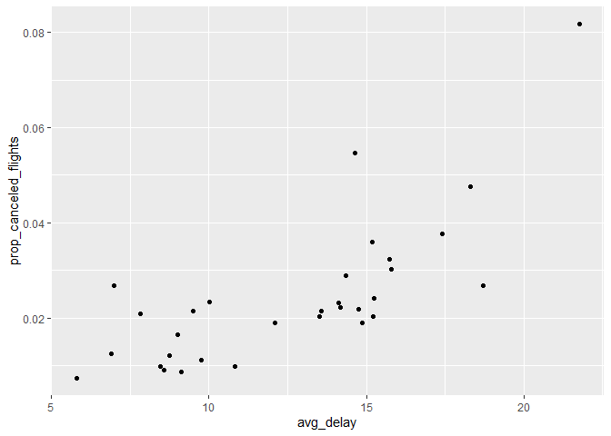

Homework 1
================
Justin Li
2022-09-24

1.  How many flights have a missing dep_time? What other variables are
    missing? What might these rows represent?

``` r
flights %>%
  filter(is.na(dep_time))
```

    ## # A tibble: 8,255 × 19
    ##     year month   day dep_time sched_de…¹ dep_d…² arr_t…³ sched…⁴ arr_d…⁵ carrier
    ##    <int> <int> <int>    <int>      <int>   <dbl>   <int>   <int>   <dbl> <chr>  
    ##  1  2013     1     1       NA       1630      NA      NA    1815      NA EV     
    ##  2  2013     1     1       NA       1935      NA      NA    2240      NA AA     
    ##  3  2013     1     1       NA       1500      NA      NA    1825      NA AA     
    ##  4  2013     1     1       NA        600      NA      NA     901      NA B6     
    ##  5  2013     1     2       NA       1540      NA      NA    1747      NA EV     
    ##  6  2013     1     2       NA       1620      NA      NA    1746      NA EV     
    ##  7  2013     1     2       NA       1355      NA      NA    1459      NA EV     
    ##  8  2013     1     2       NA       1420      NA      NA    1644      NA EV     
    ##  9  2013     1     2       NA       1321      NA      NA    1536      NA EV     
    ## 10  2013     1     2       NA       1545      NA      NA    1910      NA AA     
    ## # … with 8,245 more rows, 9 more variables: flight <int>, tailnum <chr>,
    ## #   origin <chr>, dest <chr>, air_time <dbl>, distance <dbl>, hour <dbl>,
    ## #   minute <dbl>, time_hour <dttm>, and abbreviated variable names
    ## #   ¹​sched_dep_time, ²​dep_delay, ³​arr_time, ⁴​sched_arr_time, ⁵​arr_delay

There are 8255 flights that have a missing dep_time. Other variables
that are missing are dep_delay, arr_time, arr_delay, and air_time. These
rows suggest that these rows were canceled.

2.  Currently dep_time and sched_dep_time are convenient to look at, but
    hard to compute with because they’re not really continuous numbers.
    Convert them to a more convenient representation of number of
    minutes since midnight.

``` r
flights %>%
  mutate(new_dep_time = ((dep_time %/% 100) * 60) + dep_time %% 100,
   new_sched_dep_time = ((sched_dep_time %/% 100) * 60) + sched_dep_time %% 100)
```

    ## # A tibble: 336,776 × 21
    ##     year month   day dep_time sched_de…¹ dep_d…² arr_t…³ sched…⁴ arr_d…⁵ carrier
    ##    <int> <int> <int>    <int>      <int>   <dbl>   <int>   <int>   <dbl> <chr>  
    ##  1  2013     1     1      517        515       2     830     819      11 UA     
    ##  2  2013     1     1      533        529       4     850     830      20 UA     
    ##  3  2013     1     1      542        540       2     923     850      33 AA     
    ##  4  2013     1     1      544        545      -1    1004    1022     -18 B6     
    ##  5  2013     1     1      554        600      -6     812     837     -25 DL     
    ##  6  2013     1     1      554        558      -4     740     728      12 UA     
    ##  7  2013     1     1      555        600      -5     913     854      19 B6     
    ##  8  2013     1     1      557        600      -3     709     723     -14 EV     
    ##  9  2013     1     1      557        600      -3     838     846      -8 B6     
    ## 10  2013     1     1      558        600      -2     753     745       8 AA     
    ## # … with 336,766 more rows, 11 more variables: flight <int>, tailnum <chr>,
    ## #   origin <chr>, dest <chr>, air_time <dbl>, distance <dbl>, hour <dbl>,
    ## #   minute <dbl>, time_hour <dttm>, new_dep_time <dbl>,
    ## #   new_sched_dep_time <dbl>, and abbreviated variable names ¹​sched_dep_time,
    ## #   ²​dep_delay, ³​arr_time, ⁴​sched_arr_time, ⁵​arr_delay

3.  Look at the number of canceled flights per day. Is there a pattern?
    Is the proportion of canceled flights related to the average delay?
    Use multiple dyplr operations, all on one line, concluding with
    ggplot(aes(x= ,y=)) + geom_point().

``` r
flights %>%
  group_by(day) %>%
  summarise(avg_delay = mean(dep_delay, na.rm = T),
            total_flights = n(),
            canceled_flights = sum(is.na(dep_delay)),
            prop_canceled_flights = canceled_flights / total_flights) %>%
  ggplot(aes(x = prop_canceled_flights, y = avg_delay)) + geom_point()
```

<!-- -->

It seems like as proportion of canceled flights increases, so does the
average delay.
